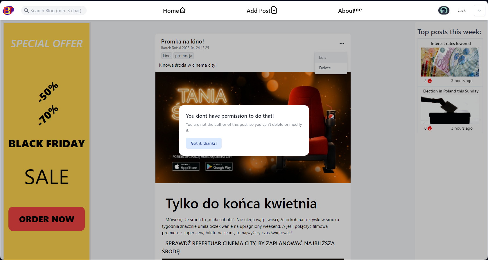

# Backend with spring boot for Blog application (deployed on Azure web services, still in development)

### It is a spring boot app that provides REST API endpoints for frontend React app, it enables CRUD operations on posts and comments. Backend is connected to MongoDB database (Azure Cosmos DB).
#### Developer further on another repository [Link]https://github.com/BartoszTanski/BlogAppWithSecurity

#### Application functionalites:
- CRUD operations on posts
- video and image storage in database
- streaming videos from database 
- image compression
- searching for posts by title(regex) and by tag
- sorting posts and pagination

#### Frontend application is deployed on azure web services and accesible (_[here](https://bartosztanski.azurewebsites.net "bartosztanski.azurewebsites.net")_)
#### Backend application is also deployed on azure web services and accesible (_[here](https://blogbartosz.azurewebsites.net/ "blogbartosz.azurewebsites.net")_), endpoints list at the bottom of README

# UI - screenshots

## Home 
[ Link](https://bartosztanski.azurewebsites.net)

### Post
[ Link](https://bartosztanski.azurewebsites.net/posts/6523bc7072bf6b63d22092e8?postIndex=0)

### Search
[ Link](https://bartosztanski.azurewebsites.net)

### Adding post
[ Link](https://bartosztanski.azurewebsites.net/posts/createPost)

### Editing/deleting post
[_Link - authorization needed](https://bartosztanski.azurewebsites.net/posts/6501fadf13f41a7dc052d57a)

### Editing
[_Link - authorization needed](https://bartosztanski.azurewebsites.net/posts/edit/6501fadf13f41a7dc052d57a)

### Deleting
[_Link - authorization needed](https://bartosztanski.azurewebsites.net/posts/6501fadf13f41a7dc052d57a)

### Adding Comments
[ Link](https://bartosztanski.azurewebsites.net/posts/6523bc7072bf6b63d22092e8?postIndex=0)

#### Backend endpoints:
- https://blogbartosz.azurewebsites.net/api/v1/posts (GET) Returns list of all posts in database
- https://blogbartosz.azurewebsites.net/api/v1/posts (POST) Adds new post to database
- https://blogbartosz.azurewebsites.net/api/v1/post/{postId} (GET) Returns single post with given id
- https://blogbartosz.azurewebsites.net/api/v1/post/{postId} (PUT) Modifies post with given id
- https://blogbartosz.azurewebsites.net/api/v1/post/{postId}/comments (GET) Returns comments to post with given id
- https://blogbartosz.azurewebsites.net/api/v1/post/{postId}/comments (POST) Adds new comment to post with given id
- https://blogbartosz.azurewebsites.net/api/v1/post/{postId}/{commentId} (DELETE) Deletes comment with given id from post
- https://blogbartosz.azurewebsites.net/api/v1/video/stream/{videoId} (GET) Returns video with given id
- https://blogbartosz.azurewebsites.net/api/v1/video/ (POST) Adds new video to DB, returns video Id
- https://blogbartosz.azurewebsites.net/api/v1/video/stream/{id} (GET) Returs video stream
- https://blogbartosz.azurewebsites.net/api/v1/video/{id} (DELETE) Deletes video by id 
***

To perform actions other than GET use REST CLIENT ex.(Postman, Insomnia)
